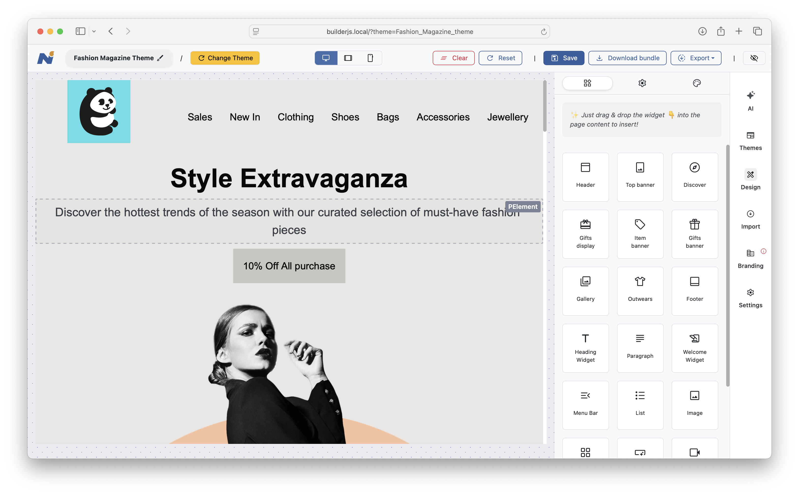
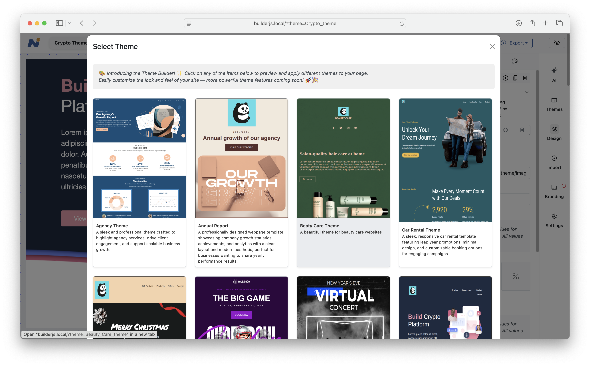
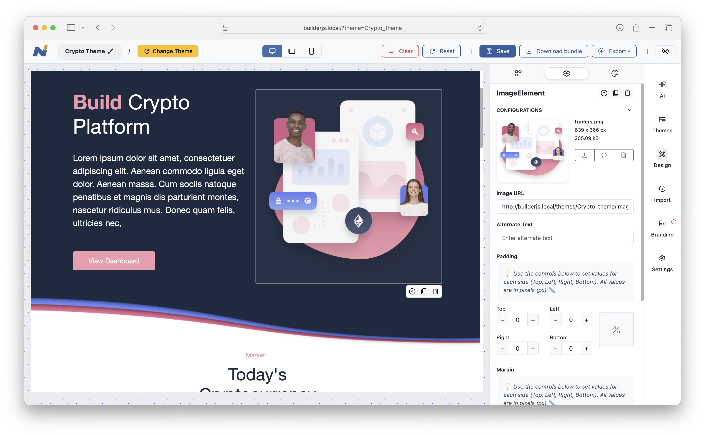

# Introduction

Welcome to **Emotsy Builder 6.0**, the most powerful HTML Email or Page builder tool. Emotsy Builder is the easiest, quickest way to design elegant, mobile responsive emails or landing pages for your business.

Emotsy Builder is built using pure JavaScript and HTML, making it easy to integrate with any web application, regardless of the server-side programming language (e.g., Java, .NET, PHP, Ruby on Rails, Python, etc.).

Emotsy Builder is fully customizable and designed for flexible integration scenarios. You can use it as a standalone application or embed it into your own web app, interacting with it through its simple and easy API. Emotsy Builder has been choosen by many popular frameworks as their site or email builder.

Details of all available API methods are explained throughout this documentation.

# Get quickly started

```html
<!DOCTYPE html>
    <head>
        <link rel="stylesheet" href="/builder/dist/builder.css"></link>
        <script type='text/javascript' src="/builder/dist/builder.js"></script>
    </head>
    <body>
        <script language="Javascript">
            // ......

            document.addEventListener('DOMContentLoaded', () => {
                // Initialize the Builder instance
                window.builder = new Builder({
                    mainContainer: '#MainContainer', // Main content render target
                    settingsContainer: '#SettingsContainer', // Sidebar settings panel
                    themeUrl: '<?php echo $themeUrl ?>', // Absolute theme base URL
                    assetUploadHandler: '/asset-upload.php', // Asset upload endpoint
                    aiHandler: '/ai-handler.php', // API handler for ai related tasks
                });

                // Initialize Builder and load the last saved state (if any).
                builder.init(() => {
                    // Load the saved page data for the current theme (if available)
                    loadFromStore(document.getElementById('loadFromStoreButton'));
                });

                // ...
            });

            // ...
        </script>
    </body>
</html>
```

When saving or publishing your HTML designs (e.g., by clicking the Save or Export button), Emotsy Builder sends the content to a server-side script. This script processes the content by either saving the current HTML design to storage or preparing it for download.

The installation process is explained in detail in the Installation section. However, if you'd like a quick preview of Emotsy Builder in action with its core features, follow these steps:

* Download the Emotsy Builder package.

* The package includes a `demo` folder. Copy this folder to your web server's document root, for exmaple `/var/www/demo`.

* Open the corresponding URL in your browser to launch the demo: http://your-host.com/demo/

That's it! You can now explore your own instance of Emotsy Builder hosted on your server.

The demo includes a sample index.php file that loads the necessary Emotsy Builder resources. It also comes with server-side scripts (written in PHP) to handle interactions such as Save and Export. You can use the provided PHP scripts as-is or implement similar functionality in any server-side language you're comfortable with, such as Ruby, Perl, .NET, Java, and more.

# Installation

In the previous section, we provided a quick-start guide to help you run a demo installation of Emotsy Builder, allowing you to see how it works in your environment. In this section, we'll walk through a step-by-step guide to installing Emotsy Builder and configuring it to work with your server-side scripting.

There are two main parts to the installation:

* The Emotsy Builder frontend (client side)

* The server-side script

Explanation: Emotsy Builder runs entirely on the client side — in the user's browser — where it provides a visual interface for building beautiful HTML pages. However, when it comes to saving or publishing a user's design, you'll need to capture the output (the HTML content) and send it to a server-side script, which either saves the data or prepares it for download.

In the next section, we'll show you how to set up Emotsy Builder and include a demo illustrating how to capture its output and pass it to a server-side script for storage or export.

## Include required files

> Put the following HTML / JavaScript code snippet to your HTML page. Make sure you update the reference paths `href` and `root` values accordingly to your setup:

```html
<!DOCTYPE html>
    <head>
        <link rel="stylesheet" href="/builder/dist/builder.css"></link>
        <script type='text/javascript' src="/builder/dist/builder.js"></script>
    </head>
    <body>
        <script language="Javascript">
            var builder = new Emotsy Builder({
                mainContainer: '#main',
                settingContainer: '#idDiv3',
            });
        </script>
    </body>
</html>
```

> It's that simple! Include the whole HTML drag & drop builder to your webapp. In the next sections, we will explain how you can initialize and have it populate your page.

There are 2 files which are shipped with Emotsy Builder bundle

* builder.js - include all core functionality of Emotsy Builder
* style.css - the default styles for Emotsy Builder, used for its controls and dashboard.

Optionally, you can include Bootstrap CSS to improve userbility experience.

Once you have included Emotsy Builder .js file, the next step is to write JavaScript code to initalize the Builder. The example code on the right to see how to initalize a `builder` object with minimum configuration. After this step, you will have a `builder` object available for rendering in the next step

## Create a new page

> Notice the `themeUrl` parameter of construction method: it is required in order to initialize a new page

```html
<!DOCTYPE html>
    <head>
        <link rel="stylesheet" href="/builder/dist/builder.css"></link>
        <script type='text/javascript' src="/builder/dist/builder.js"></script>
    </head>
    <body>
        <script language="Javascript">
            var builder = new Emotsy Builder({
                mainContainer: '#main',
                settingContainer: '#idDiv3',
                themeUrl: "/myAwesomeTheme/", // required by init() function
            });


            builder.init(theme = "/theme/abc");
        </script>
    </body>
</html>
```

Now it's time to load the builder in your browser.

If you want to start with a blank page for a new HTML or email design, execute the `init()` function. See the example code in the right panel.

Note the themeUrl parameter in the constructor method, this is required to initialize a new page. In Emotsy Builder, every page is created based on a theme, which consists of a set of related styles and page elements.

If everything is configured correctly, the builder interface will be rendered in your browser, and a sample page like the one below will be loaded:



Another sample:


Yet another sample:



## Open a page

Rather than starting from a blank page, you’ll often want to load previously saved work to continue designing. Emotsy Builder supports multiple ways to load HTML content into the builder view.

### From JSON string

> Load a page from JSON string

```html
<!DOCTYPE html>
    <head>
        <link rel="stylesheet" href="/builder/dist/builder.css"></link>
        <script type='text/javascript' src="/builder/dist/builder.js"></script>
    </head>
    <body>
        <script language="Javascript">
            var builder = new Emotsy Builder({
                mainContainer: '#main',
                settingContainer: '#idDiv3',
            });

            var data = "<?php echo file_get_contents('/data/Pages/MyPage.json'); ?>";
            builder.load(data);
        </script>
    </body>
</html>
```

In this example, the data variable contains the entire JSON representation of an HTML page as a string. This string is then passed to the builder’s load function to display the content in the browser.

Emotsy Builder pages are stored in JSON format, which can be saved in any type of storage — such as the file system, a relational database (RDBMS), and more. Later, the stored JSON can be loaded back into the design view.

Don’t worry about the JSON format or how to generate it — this will be explained in the Storage section below.

### From URL

> Load a page from URL

```html
<!DOCTYPE html>
    <head>
        <link rel="stylesheet" href="/builder/dist/builder.css"></link>
        <script type='text/javascript' src="/builder/dist/builder.js"></script>
    </head>
    <body>
        <script language="Javascript">
            var builder = new Emotsy Builder({
                mainContainer: '#main',
                settingContainer: '#idDiv3',
            });

            var url = "http://example.com/pages/MyPage.json";
            builder.loadFromUrl(url);
        </script>
    </body>
</html>
```

Instead of loading the entire JSON data into a JavaScript variable as shown earlier, a more convenient approach is to use the loadFromUrl() method to fetch JSON content from a remote URL.

For example, if your page's JSON data is stored on a server and accessible at http://example.com/pages/MyPage.json, you can load it using this method as shown in the example.

Don’t worry about the JSON format or how to generate it — this will be covered in the Storage section below.

Below is a summary of the constructor parameters for Emotsy Builder:

Parameter | Description
--------- | -----------
mainContainer | The ID of the HTML element into which the builder design will be rendered
settingContainer | The ID of the HTML element into which the builder settings will be rendered
themeUrl | URL of the theme folder. Emotsy Builder comes with many themes and even more themes are coming.

<aside class="notice">
Loading data from a URL is recommended over embedding a large JSON string directly in your code. Assigning a large JSON string to a JavaScript variable increases the size of your HTML page, which can negatively impact loading performance.
</aside>


# Theme & Template

A theme consists of sample element templates that share a unified style. Every website or page in Emotsy Builder is based on a theme.

Some examples of themes include:

* Simple blogpost theme
* Clean and element landing page theme
* Minimal theme for online art gallery
* Amazon-like online store
* More...

Themes and templates are at the core of Emotsy Builder. A theme consists of many element templates that users can quickly access by dragging and dropping them into the page designer. Each theme comes with its own unique styles and a predefined set of components for users to choose from.

Some example components in a theme include:

* Menu bar
* Main banner
* Carousel banner
* About us block
* New features block
* Footer area
* Testinomial area

Users can simply choose an element, drag and drop it into the designer view, and modify the element’s content to quickly create their own page.

## Create a theme

Besides the available templates in Emotsy Builder, you can also create your own custom theme to enhance your users’ experience. The idea behind creating a theme is:

Design a beautiful web page or email template.

Break it into elements so users can organize and customize them by dragging and dropping elements as they desire.

* Open your terminal
* Go to the `builder/` folder
* Execute the following command to generate a theme skeleton `generate theme your_theme_name`

Steps to create a theme for Emotsy Builder:
Open your terminal.

Navigate to the `builder/` folder.

Execute the following command to generate a theme skeleton:

`
generate theme your_theme_name
`

After running the command, a new folder named your_theme_name will be created, containing sample templates for your theme, ready for modification.

Note: The detailed specifications and guidelines for working with themes are still under development. The Emotsy Builder team is actively working to publish more themes for users every day. A comprehensive guideline will be released soon to help development teams create their own themes with ease.

# Server Script

Setting up Emotsy Builder involves certain steps, especially when configuring the page that wraps around it and interacts with it. However, this is intended by design: Emotsy Builder is built to be fully customizable.

For example, Emotsy Builder does not include any default **SAVE** or **EXPORT** buttons. You will need to add these buttons yourself and handle their click events. When the user clicks the **SAVE** button, it should call the builder's `getJson()` API method to retrieve the current design. From there, it's up to you to handle the result—for instance, by sending it via an AJAX request to a server-side script that saves it to local storage, a database management system (DBMS), or remote storage such as AWS S3.

By creating the buttons yourself, you're not limited to Emotsy Builder's default style—you’re free to place them anywhere on your page and style them however you like.

## Save

```html
<!DOCTYPE html>
<html lang="en">
<body>

  <button id="btnSave">Save</button>

  <script>

    // Function that handles saving
    function save() {
      var data = builder.getJson();

      $.ajax({
        url: 'save.php',       // Your server-side script
        data: {
          page_id: 'Page #ID',
          data: builder.getJson(),
        }
        success: function (response) {
          console.log("Save successful:", response);
        },
      });
    }

    // Assign click event
    document.getElementById("btnSave").addEventListener("click", save);
  </script>

</body>
</html>
```

```python
# Sample controller code for handling the save request
# sent from Emotsy Builder

# Python code sample is not yet available
# comming soon!
```

```ruby
# Sample controller code for handling the save request
# sent from Emotsy Builder

require 'activerecord'
require 'mysql'

# Set up MySQL connection
ActiveRecord::Base.establish_connection(
  adapter: 'mysql2',
  database: 'myDB',
  username: 'user',
  password: 'password'
)

# Associate Template class with the `templates` data table
class Template < ActiveRecord::Base
  # associated with `templates` table
end

# Retrieve parameters passed to the server script
content = params[:content]
template_id = params[:id]

# Actually update the MySQL database
template = Template::find(template_id)
template.content = content

template.save
```

```php
<?php

// Sample controller code for handling the save request
// sent from Emotsy Builder

// MySQL credentials
$servername = "localhost";
$username = "user";
$password = "password";
$dbname = "myDB";

// Create connection
$conn = new mysqli($servername, $username, $password, $dbname);

// Retrieve parameters passed to the server script
$pageId = $_POST['page_id'];
$data = $_POST['data'];

// Actually update the MySQL database
$sql = "UPDATE pages SET data = '{$data}'
        WHERE id = '{$pageId}'";

if ($conn->query($sql) === TRUE) {
    echo "Saved successfully";
}

$conn->close();
```

Once you have initialized the builder and either loaded a template or started a new page, you can begin designing your pages and emails.

To save your current work for future editing, you need to capture the current data from Emotsy Builder and store it in a system such as a filesystem or MySQL database.

Since Emotsy Builder is a pure JavaScript application running in the browser, it does not store any data by itself — this is where a server-side script becomes necessary.

The most common approach is to use Emotsy Builder’s getJson() API method to capture the current state, then send the resulting data to a server script via Ajax for storage. In this example, we provide backend handlers implemented in PHP and Ruby, though you can use any programming language you prefer. The key point is capturing and handling the input.

Click the php or ruby tabs in the code sample panel to see the details. Refer to the example on the right to understand how this works in practice.

Summary of steps:

* Load Emotsy Builder

* Create a new page to design

* Add a “Save” button that, when clicked, retrieves the builder data and sends it to the server’s save.php script, which stores the HTML content in a MySQL database.

Instead of storing builder data to MySQL, you are free to handle it any way you want in your server-side script.

## Export, Publish and Download

The next common task is exporting the page for real-world use. Once users finish their design and click the **Export** button, the final HTML content is sent to a server-side script that handles the export process—typically via an AJAX request. See the example on the right.

Emotsy Builder provides a `getHtml()` method that captures the final HTML of the designed page.

After receiving the HTML content, the server script can save it to a file and make it available for download. The exported HTML file can then be uploaded to a hosting environment.

// List of available templates
var templates = [
  {
      name: 'My Awesome Template 1',
      url: 'http://example.com/template/030331',
      thumbnail: 'http://example.com/template/030331/thumb.png'
  }, {
      name: 'My Awesome Template 2',
      url: 'http://example.com/template/030332',
      thumbnail: 'http://example.com/template/030332/thumb.png'
  }, {
      name: 'My Awesome Template 3',
      url: 'http://example.com/template/030333',
      thumbnail: 'http://example.com/template/030333/thumb.png'
  }, {
      name: 'My Awesome Template 4',
      url: 'http://example.com/template/030334',
      thumbnail: 'templates/030334/thumb.png'
  }
];

// Pass to the builder
var builder = new Editor({
    root: '/builder/dist/',
    templates: templates
});

</script>
```

> Notice that `templates` parameter expects an array of templates, each with `name`, `url` and `thumbnail`

Emotsy Builder allows you to create new blank workspace and build your design from scratch.
However, most of the time, you may want to start making your own email or page design from an existing template, then taylor it to your own needs.

You can also pass a list of available templates to Emotsy Builder, and it will in turn show up to user for choosing from, by going to `Design > New From Template`


See example on the right to find out how to pass a list of available templates to your builder.

## Responsive

Emotsy Builder supports making email or pages that are fully responsive. You can preview your design with a PC, tablet or mobile phone simulator supported by Emotsy Builder. It is to make sure your email or page will show up correctly in reality

## HTML Widgets

Emotsy Builder comes with lots of pre-defined HTML widgets (or block or common HTML content) like image box, text box, divider, page footer, email signature, banner, etc. providing you everything you need to build an email or page

## Custom Widgets

You can also add your own widget to the list for using later on. Emotsy Builder supports "Add to widget library" feature, allowing you to select an element or group of elements to become a widget.


# Integration

Since Emotsy Builder is a pure JavaScript library that accepts parameters during initialization, it can be integrated with any programming language or database system.

Its main function is to load an HTML template, allow users to make changes via visual drag-and-drop or source editing, and then submit those changes to the server for storage. You can use PHP, Ruby, Python, Java, .NET, or any other server-side scripting language to handle Emotsy Builder requests. The distributable package also includes sample PHP scripts for saving, exporting, and more.


# Customization

```html
<script>
    class MySampleWidget extends Widget {
        // get HTML to insert into content
        init() {
            super.init();
        }

        title() {
            return 'My Sample Widget';
        }

        renderHtml() {
            return '<div> A Simple Widget with 1 line of text </div>';
        }

        // custom behavior goes here...
</script>
```

Emotsy Builder is written with a well-designed structure that allows for easy and straightforward customization. For example, you can add your own custom widget to the library alongside the default ones such as Text, Image, Video, Social Network Icons, and more. Check the right panel’s JavaScript tab to learn how to create a custom widget.

By extending the Widget base class, your MySampleWidget will automatically inherit all the common widget behaviors like drag-and-drop functionality, and support for moving, duplicating, and deleting. You can also define its own characteristics, such as title and thumbnail, by overriding the corresponding methods.

Documentation is currently being updated. In the meantime, please contact us for more details on this topic.
